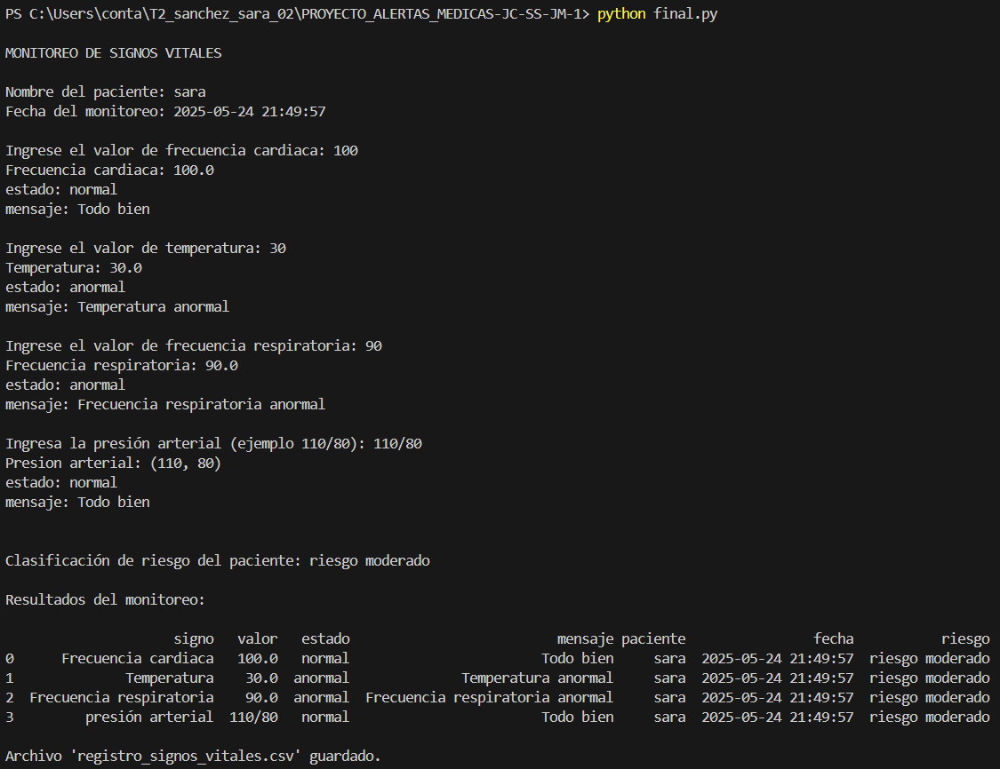
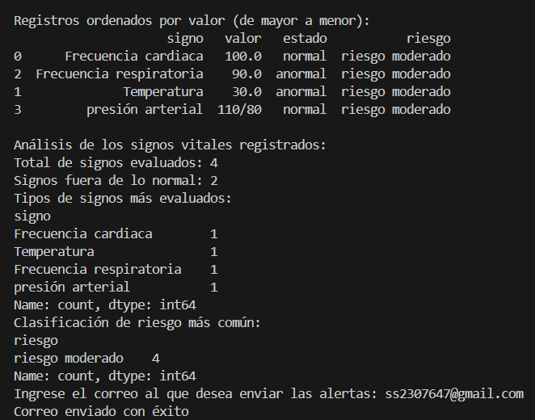

# MONITOREO_DE_SIGNOS_VITALES
## ✨ Proyecto de Simulación y Monitoreo en Tiempo Real ✨

### 👥 Integrantes del Proyecto
👨‍💻 Jacobo Minjarez

👨‍💻 Jesús Carrillo

👩‍💻 Sara Sánchez

## 🌐 Introducción

____________________________________________________________________________________________

El monitoreo de signos vitales es clave en la salud, ya que permite evaluar en tiempo real el estado fisiológico del paciente. Algunos de los parámetros esenciales incluyen:

❤️ Frecuencia Cardíaca

🧬 Presión Arterial

💉 Saturación de Oxígeno

🧐 Temperatura Corporal

Este proyecto desarrollará un software de simulación para visualizar y analizar estos datos de forma dinámica, permitiendo a los usuarios observar alertas y detección de anomalías clínicas en los signos vitales en distintos escenarios clínicos.

____________________________________________________________________________________________

## ⚙️ Funcionamiento del Software

🔄 Generación de datos: Se crean valores representativos de signos vitales, tanto normales como anómalos.

⚡ Comparación de datos: Los valores se contrastan con límites establecidos y se activan alertas si es necesario.

📲 Visualización en tiempo real: El usuario puede observar los signos vitales de manera interactiva.

🚨 Alertas: Mensajes por medio de correos cuando se detectan valores críticos.
🛡️Robustez:Uso de manejo de excepciones para evitar caídas.

## 🤖 Guía de Uso

### Para desarrolladores e ingenieros biomédicos:

Clonar el repositorio y crear un entorno virtual.

Configurar las variables de entorno (.env) con los datos de correo seguro.

Ejecutar el archivo main.py y observar el monitoreo en consola.

Asegurar el correcto funcionamiento del código en el entorno de ejecución.

### Para usuarios finales:

Observar los valores de sus signos vitales en la pantalla.

Seguir las indicaciones del personal de salud en caso de recibir una alerta.

Consultar con un especialista si los valores registrados presentan irregularidades frecuentes.

## 🔍 Pruebas de Escritorio
### Ejemplo de prueba de escritorio:

## 🔐 Seguridad

- Las contraseñas y credenciales se almacenan en un archivo .env local, usando python-dotenv y os.getenv().
- El archivo .env está excluido del repositorio con .gitignore.

## 🧪 Manejo de Errores y SMTP

- Se emplea try-except para capturar errores comunes como:
  - `smtplib.SMTPAuthenticationError`
  - `smtplib.SMTPConnectError`
  - `smtplib.SMTPRecipientsRefused`
- Si el envío de correo falla, el error se registra y se continúa el programa sin bloquear al usuario.

## Herramienta de monitoreo profesional en la nube:
A continuación, se muestran capturas que ilustran el manejo de errores y la integración con Sentry:

____________________________________________________________________________________________

## 🔍 Conceptos Clave

💻 Desarrollo en Python para la simulación y visualización de signos vitales.

⚖️ Análisis de datos fisiológicos en distintos contextos clínicos.

💡 Herramienta educativa e investigativa para mejorar la toma de decisiones en entornos médicos y tecnológicos.

## 🎨 Nuestro Reto en el Desarrollo del Software

El principal desafío de este proyecto es lograr una simulación realista y eficiente del monitoreo de signos vitales. Para ello, enfrentamos los siguientes retos clave:

Manejo de errores SMTP: Capturar errores específicos del envío de correos para mayor robustez.

Seguridad: Evitar exposición de contraseñas mediante uso correcto de .env.

Pruebas de escritorio claras: Diseñar escenarios que permitan validar fácilmente el funcionamiento del sistema.

## 📝 Funcionalidad

Simulación de signos vitales: Genera valores realistas para frecuencia cardíaca, presión arterial, saturación de oxígeno y temperatura corporal.

Análisis en tiempo real: Detecta desviaciones clínicas comparando los datos simulados con rangos normales.

Alertas automáticas: Notifica por consola y correo electrónico ante valores críticos.

Seguridad: Protege contraseñas usando variables de entorno.

Manejo de errores: Captura excepciones específicas para mantener la estabilidad del sistema.

Registro y monitoreo: Usa logging y permite integración con herramientas como Sentry.

Código modular: Diseño limpio, escalable y fácil de mantener.

____________________________________________________________________________________________

## 📖 Referencias Bibliográficas
- Python Software Foundation. (2024). [Python 3 Documentation](https://docs.python.org/3/)
- Sentry. (2024). [Sentry for Python Docs](https://docs.sentry.io/platforms/python/)
- smtplib — SMTP protocol client — Python Docs. (2024). [smtplib Reference](https://docs.python.org/3/library/smtplib.html)
- pandas Documentation. (2024). [https://pandas.pydata.org/docs](https://pandas.pydata.org/docs)
- Enderle JD, Bronzino JD. *Introduction to Biomedical Engineering*. Academic Press, 2012. **(Usado como marco conceptual para la importancia del monitoreo de signos vitales)**
